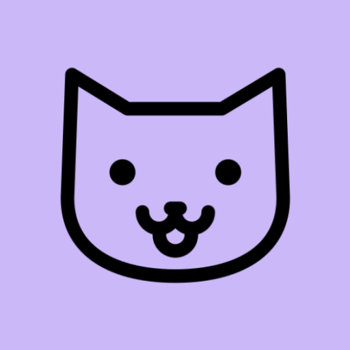

<h1>Nekolery</h1>
<h2>Эксперимент по созданию приложения полностью с помощью нейросети</h2>

Итак — это был лишь забавный, шуточный запрос в одного из чат-ботов с запросом дать код для приложения галереи. 
Я не думал, что из этого что-то выйдет... Однако спустя месяц — я получил нечто большее. 
Это — полностью готовое приложение с некоторым функционалом.

<h1>В данный момент я остановил "разработку" в связи с получением нужного результата и отсутствия идей по "развитию"</h1>

  В планах - переписать проект с нуля своими силами. 

<h1>Основные функции</h1>
<ul>
  <li>Экран с папками</li>
  <li>Экран со всеми медиа на устройстве</li>
  <li>Экран избранных</li>
  <li>Корзина</li>
  <li>Секретное хранилище</li>
  <li>Просмотр медиа</li>
  <li>Копирование/Перемещение</li>
  <li>Система тегов и разбиение тегов по папкам в избранных</li>
</ul>

<h1>Дополнительный функционал</h1>
<ul>
  <li>Настройка блюра</li>
  <li>Плавающая кнопка</li>
  <li><b>Функционал кнопки — Перемешивание медиа, Открытие камеры</b></li>
  <li>Резервное копирование тегов и избранных</li>
  <li>Жест «Встряхивание» для быстрого включения блюра</li>
  <li>Получение обновлений через Github</li>
</ul>

<h1>На чём сделано</h1>

Kotlin + Jetpack Compose + Material You.
  Нейросети, которые были использованы - Google Gemini, OpenAI ChatGPT.

<h1>Скриншоты</h1>

<!-- Ты можешь менять width="300" на любой -->
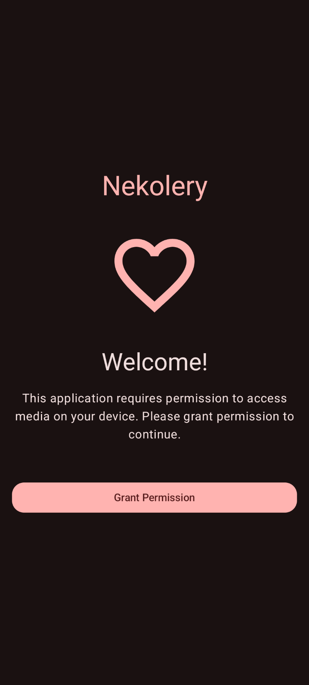

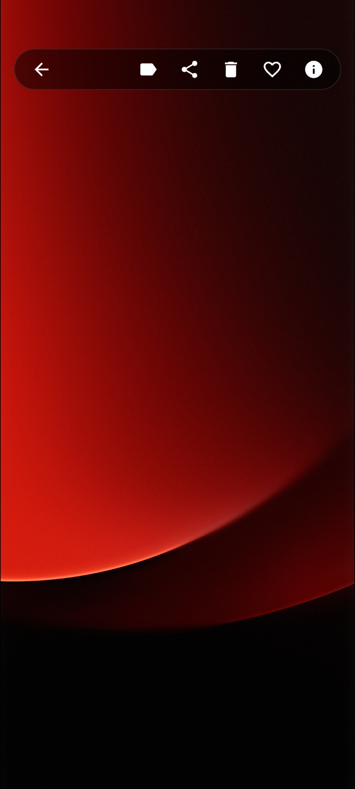
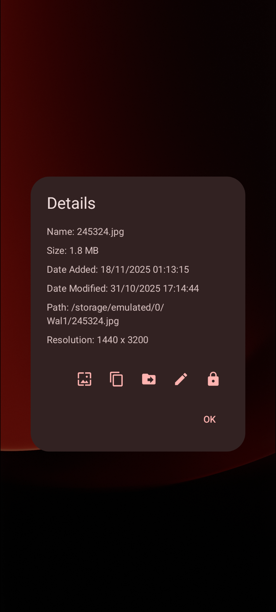
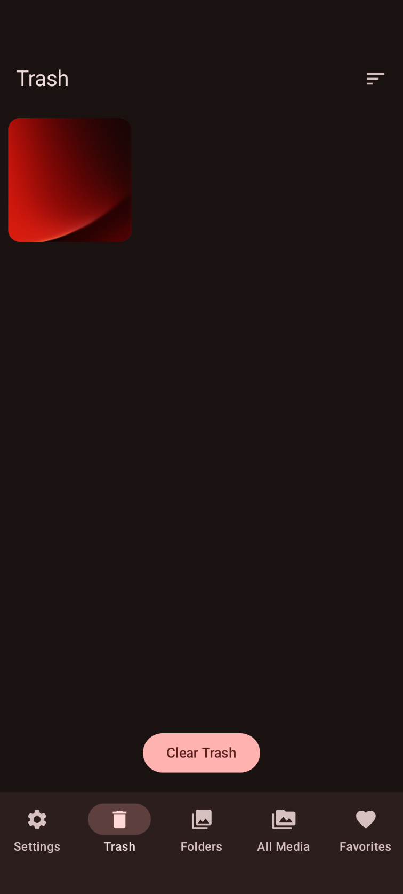
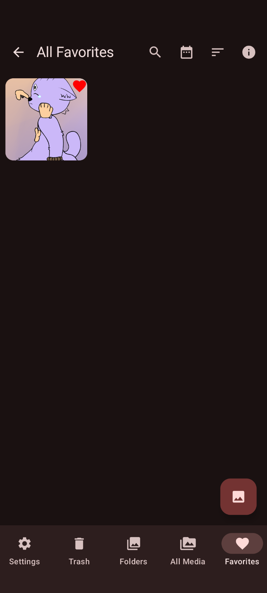
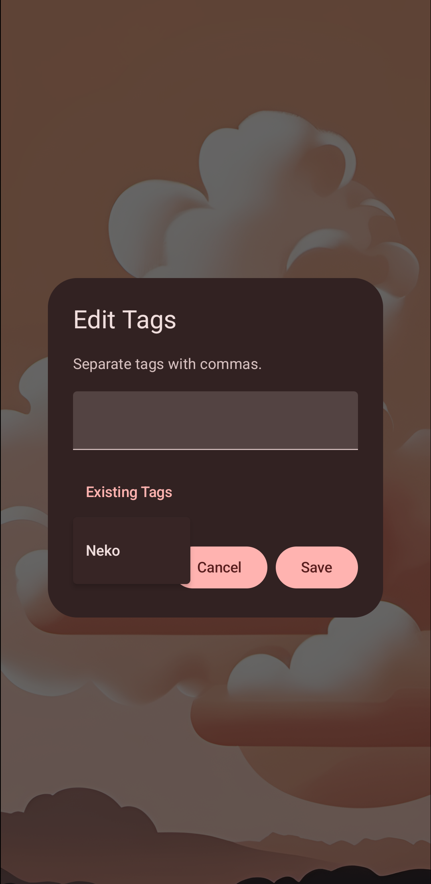
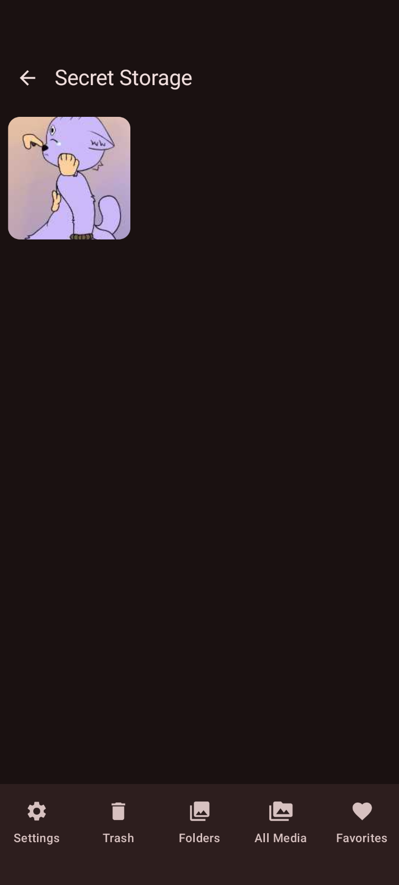
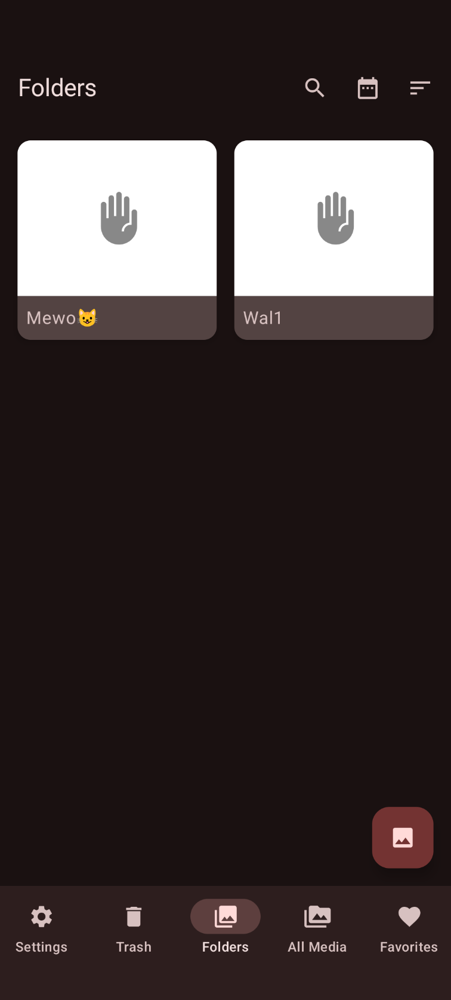
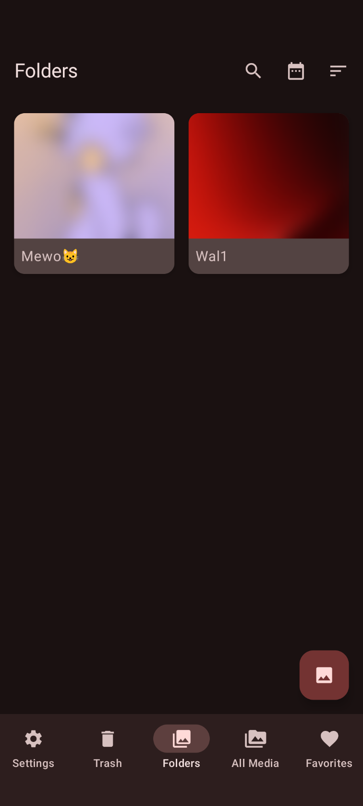
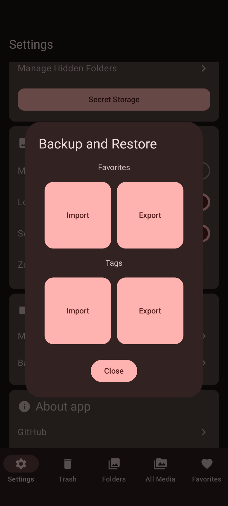
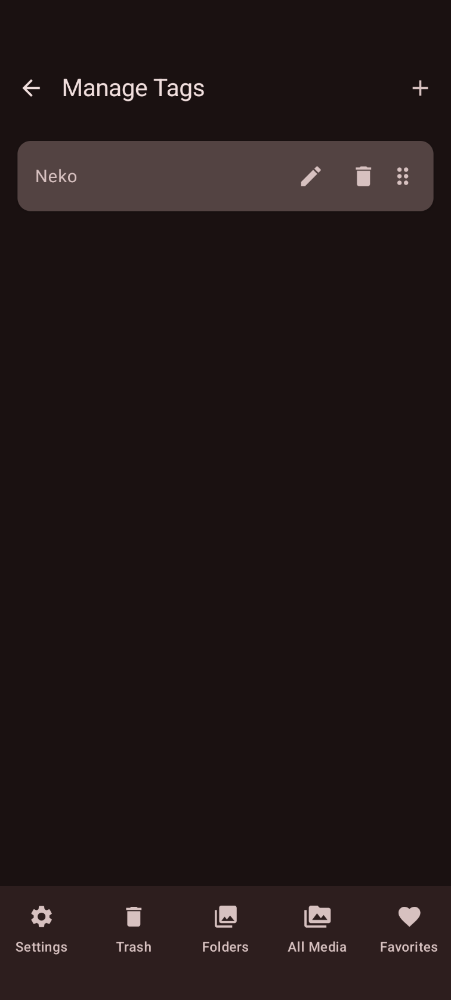
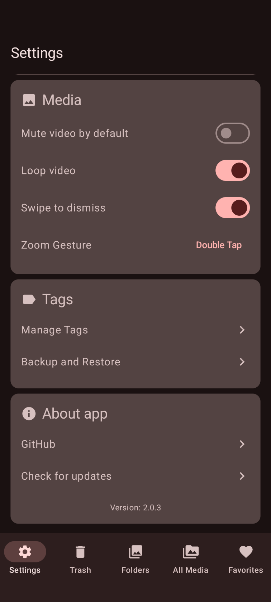
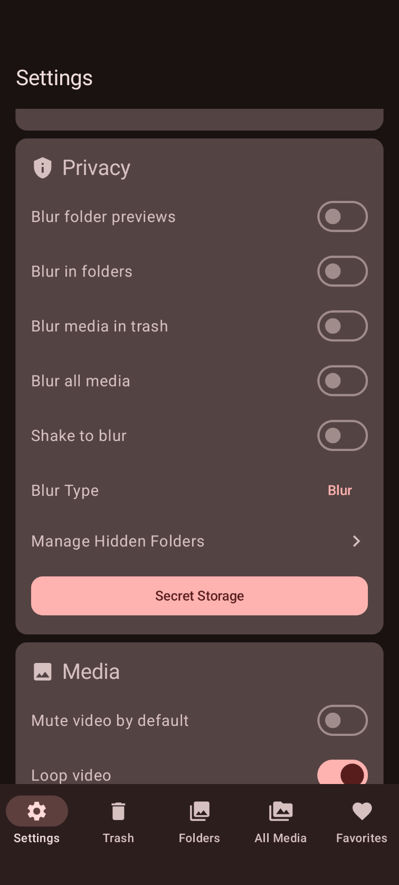
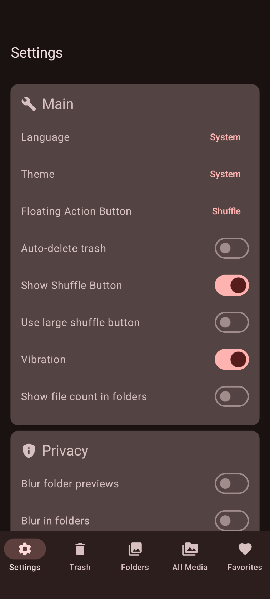

<h1><b>Я сделал всё это в качестве личного эксперимента и для личного пользования, не призываю и не заставляю использовать это приложение.</b></h1>

  Кроме как протестировать.

